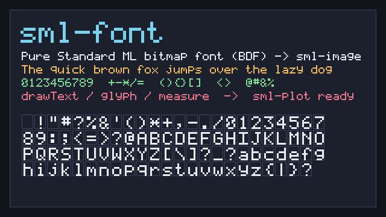

# sml-font

Bitmap font glyph rendering in pure Standard ML — parse a
[BDF](https://en.wikipedia.org/wiki/Glyph_Bitmap_Distribution_Format) font and
draw text straight into an [`sml-image`](https://github.com/sjqtentacles/sml-image)
RGBA8 raster. No FFI, no external dependencies, and **deterministic**,
byte-identically under both [MLton](http://mlton.org/) and
[Poly/ML](https://www.polyml.org/).

This is the first reusable font library in the sjqtentacles ecosystem (the
5x7 designs that previously lived in the `sml-tui`/`sml-diff`/`sml-markdown`
demos, productionised into a real BDF font and a parser). It is built for
[`sml-plot`](https://github.com/sjqtentacles/sml-plot) to vendor for axis
labels, titles, and legends.



*Generated by [`examples/atlas.sml`](examples/atlas.sml) (`make example`): a
framed panel drawn with [`sml-raster`](https://github.com/sjqtentacles/sml-raster),
sample lines at scales 2–5, and the full printable-ASCII glyph atlas — every
glyph rendered with `Font.drawText`, encoded to PNG.*

## Status

- 31 assertions, green on MLton and Poly/ML.
- Basis-library only; deterministic across compilers (PNG output is
  byte-identical run to run).
- Vendors `sml-image` + `sml-raster` (and their deps `sml-inflate`,
  `sml-color`) — Layout B — so the repo builds standalone.
- Ships a vendored 5x7 font, [`data/font5x7.bdf`](data/font5x7.bdf) (91 glyphs,
  printable ASCII), reproducible from [`tools/gen_bdf.py`](tools/gen_bdf.py).

## Install

With [`smlpkg`](https://github.com/diku-dk/smlpkg):

```
smlpkg add github.com/sjqtentacles/sml-font
smlpkg sync
```

Include the MLB from your own (it pulls in the vendored `sml-image` and
`sml-raster`):

```
local
  $(SML_LIB)/basis/basis.mlb
  lib/github.com/sjqtentacles/sml-font/... (via smlpkg)
in
  ...
end
```

This brings `structure Font` (and the vendored `Image`, `Raster`) into scope.

## Quick start

```sml
(* parse a BDF font from its text *)
val font = Font.parseBdf (readFile "data/font5x7.bdf")

(* a glyph as a row-major on/off bitmap, indexed row*w + col *)
val { w, h, bits } = Font.glyph font #"A"   (* w=5, h=7 *)

(* pixel extent of a string at scale 1 *)
val (tw, th) = Font.measure font "Hello"    (* (30, 7) *)

(* draw white text into a copy of an image; off-pixels are left untouched *)
val white : Image.rgba8 = { r = 0w255, g = 0w255, b = 0w255, a = 0w255 }
val img'  = Font.drawText img { x = 8, y = 8, scale = 2, color = white } font "Hello, world!"
```

## API

| Function | Type | Notes |
| --- | --- | --- |
| `parseBdf` | `string -> font` | parse a BDF font; raises `Font` on malformed input |
| `glyph` | `font -> char -> {w:int, h:int, bits:bool array}` | row-major on/off bitmap (`row*w + col`); missing chars fall back to the default glyph |
| `drawText` | `Image.image -> {x:int, y:int, scale:int, color:Image.rgba8} -> font -> string -> Image.image` | draws into a copy; `scale`×`scale` opaque blocks; clipped; `\n` starts a new line |
| `measure` | `font -> string -> int*int` | `(width, height)` in pixels at scale 1; `""` measures `(0,0)` |
| `height` | `font -> int` | font pixel height (ascent + descent) |
| `advance` | `font -> char -> int` | per-glyph advance width (BDF `DWIDTH`) |
| `numGlyphs` | `font -> int` | number of glyphs defined |

### Conventions

- **Coordinates**: top-left origin; `drawText`'s `(x, y)` is the top-left of the
  first glyph cell.
- **Bitmaps**: `glyph` returns a fresh `bool array` of length `w*h`, top-left
  origin, indexed `row*w + col`. Each call copies, so mutating the result is
  safe.
- **Rendering**: on-pixels are written as opaque `scale`×`scale` blocks of
  `color` (straight overwrite of RGBA); off-pixels are untouched. All drawing is
  clipped to the image bounds, so off-screen text never raises.
- **Advance / layout**: `drawText` advances by each glyph's BDF `DWIDTH`
  (6 px for the bundled 5x7 font: a 5 px cell + 1 px gap). `measure` sums those
  advances per line and stacks lines by `height`.
- **Fallback**: characters with no glyph render the font's `DEFAULT_CHAR`
  (`?` for the bundled font), so unknown bytes are always drawable.
- **BDF subset**: the parser reads `FONTBOUNDINGBOX`, `FONT_ASCENT`/`DESCENT`,
  `DEFAULT_CHAR`, and per-glyph `ENCODING` / `DWIDTH` / `BBX` / hex `BITMAP`
  rows (leftmost pixel in the MSB, each row padded to whole bytes) — the common
  subset emitted by real bitmap fonts. Encodings `0..255` are indexed directly.

## The bundled font

[`data/font5x7.bdf`](data/font5x7.bdf) is a 5x7 fixed-width font (advance 6)
covering printable ASCII (codes 32–126, 91 glyphs). It is regenerated
deterministically from [`tools/gen_bdf.py`](tools/gen_bdf.py), which embeds the
glyph designs and emits standard BDF. Drop in any other BDF font and `parseBdf`
will read it the same way.

## Build & test

```
make test        # MLton: build + run the suite
make test-poly   # Poly/ML: use-and-run the suite
make all-tests   # both
make example     # render assets/atlas.png
make clean
```

## License

MIT — see [LICENSE](LICENSE).
